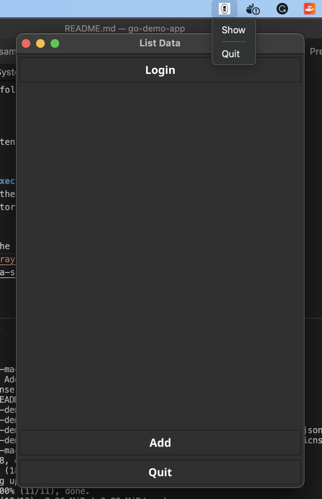

## 1. Start the jwt api


### This is just a basic implementation of jwt-token (not intended for prod use)

In the project folder:
```bash
mkdir keys
```

Create a Public and Private key:
```bash
openssl genpkey -algorithm ed25519 -out keys/private.pem

openssl pkey -in keys/private.pem -pubout -out keys/public.pem
```

In the project folder
```
go run ./cmd/auth-api keys/private.pem
```

## 2. Build the Frontend

In the project folder:
```bash
cd cmd/frontend

go run cmd/frontend/Main.go
```

## 3. Run the executable directly (Steps 1, 2 not needed)
you should see the `frontend.app` executable in the `cmd/frontend` directory

## System Tray
When started, the app also shows a System Tray Menu. 

link: [System Tray](https://developer.fyne.io/explore/systray#adding-a-system-tray-menu)

Example:
