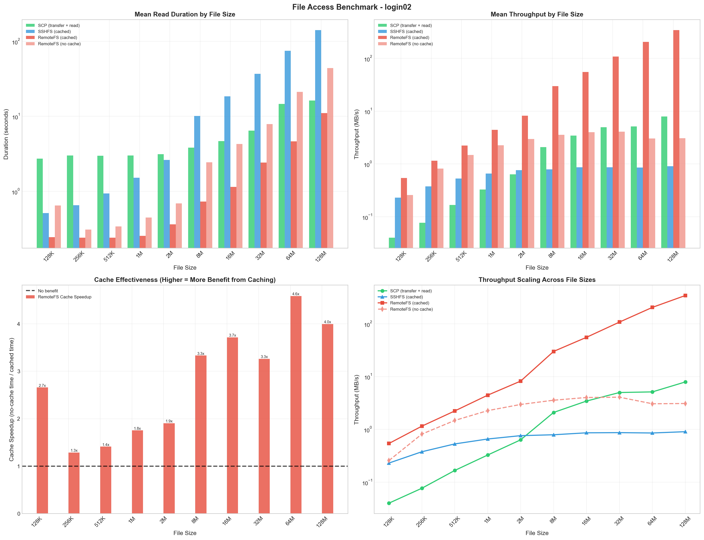
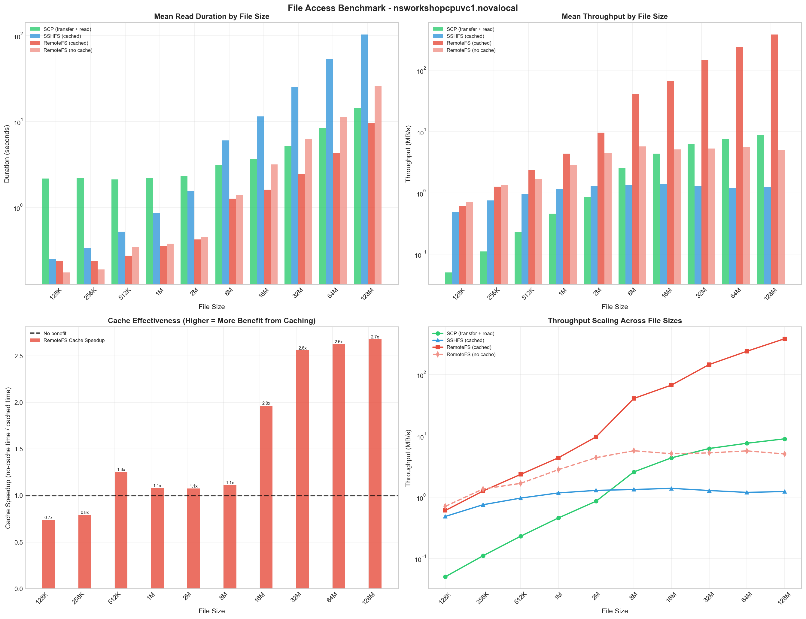
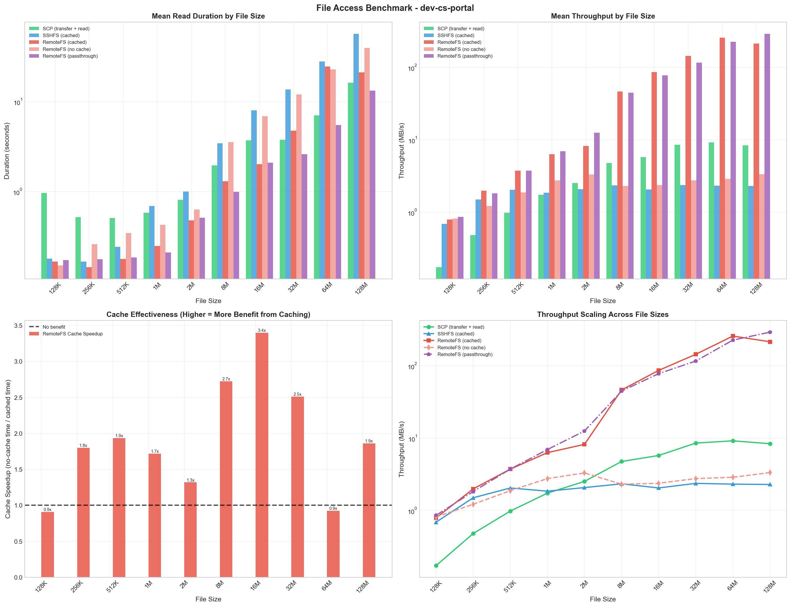
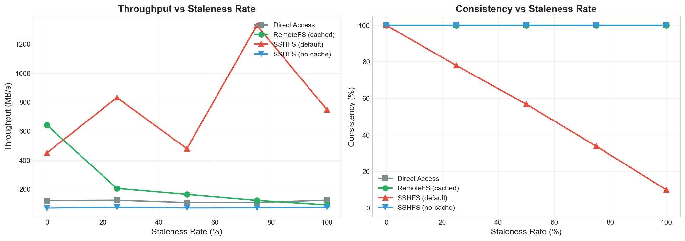

# RemoteFS Performance Benchmark Report

**Date:** February 2026

## Executive Summary

RemoteFS provides high-performance remote file access with intelligent caching and bounded-staleness consistency (~1 second). Benchmarks across three environments demonstrate up to **43x faster** throughput than SCP, with the cache providing up to **111x** speedup over uncached mode for large files.

| Metric | Value | Environment |
|--------|-------|-------------|
| Peak speedup vs SCP | **43x** (128MB) | Expanse |
| Peak cache benefit | **111x** over no-cache | Expanse |
| Max staleness window | **~1 second** (server-validated mtime) | All environments |
| SSHFS consistency at 50% staleness | **57%** (stale data!) | Local test |

---

## Test Environments

| Environment | Host | Description |
|-------------|------|-------------|
| SDSC Expanse | login02.expanse.sdsc.edu | HPC supercomputer (via ProxyJump) |
| JetStream2 | nsworkshopcpuvc1.novalocal | Virtual HPC cluster |
| Gateway | dev-cs-portal | Linux 6.11 (passthrough support) |

**Configuration:** 3 iterations per configuration, file sizes 128KB–128MB, FRP NAT traversal

**Test cases (uniform across all hosts):**
- SCP (transfer + read)
- SSHFS (direct_io, no kernel cache)
- RemoteFS cached (default in-memory block cache)
- RemoteFS no-cache (--no-cache flag)
- RemoteFS passthrough (Gateway only, Linux 6.9+)

---

## Results

### SDSC Expanse (login02)

| File Size | SCP (MB/s) | SSHFS (MB/s) | RemoteFS Cached (MB/s) | RemoteFS No-cache (MB/s) | Cache Speedup |
|-----------|-----------|-------------|----------------------|------------------------|--------------|
| 128KB | 0.04 | 0.23 | **0.54** | 0.26 | 2.1x |
| 256KB | 0.08 | 0.38 | **1.15** | 0.81 | 1.4x |
| 1MB | 0.33 | 0.66 | **4.44** | 2.26 | 2.0x |
| 8MB | 2.09 | 0.79 | **29.93** | 3.56 | 8.4x |
| 32MB | 4.99 | 0.87 | **107.61** | 4.07 | 26.5x |
| 128MB | 7.90 | 0.90 | **343.00** | 3.09 | 111.0x |

**Key Finding:** RemoteFS cached delivers up to **43x faster** throughput than SCP for large files on SDSC Expanse. The cache provides a **111x** speedup over no-cache mode for 128MB files.

### JetStream2 (nsworkshopcpuvc1)

| File Size | SCP (MB/s) | SSHFS (MB/s) | RemoteFS Cached (MB/s) | RemoteFS No-cache (MB/s) | Cache Speedup |
|-----------|-----------|-------------|----------------------|------------------------|--------------|
| 128KB | 0.05 | 0.48 | **0.60** | 0.71 | 0.9x |
| 256KB | 0.11 | 0.75 | **1.26** | 1.36 | 0.9x |
| 1MB | 0.46 | 1.17 | **4.39** | 2.80 | 1.6x |
| 8MB | 2.58 | 1.33 | **40.77** | 5.71 | 7.1x |
| 32MB | 6.22 | 1.28 | **146.15** | 5.27 | 27.7x |
| 128MB | 8.94 | 1.23 | **385.30** | 5.06 | 76.1x |

**Key Finding:** RemoteFS cached is up to **43x faster** than SCP and **76x faster** than its own no-cache mode. Cache benefit becomes significant above 1MB.

### Gateway (dev-cs-portal) – FUSE Passthrough

| File Size | SCP (MB/s) | SSHFS (MB/s) | Cached (MB/s) | No-cache (MB/s) | Passthrough (MB/s) | Cache Speedup |
|-----------|-----------|-------------|-------------|---------------|------------------|--------------|
| 128KB | 0.17 | 0.69 | **0.79** | 0.81 | 0.86 | 1.0x |
| 256KB | 0.48 | 1.50 | **1.98** | 1.22 | 1.82 | 1.6x |
| 1MB | 1.73 | 1.85 | **6.28** | 2.75 | 6.94 | 2.3x |
| 8MB | 4.75 | 2.33 | **46.13** | 2.31 | 44.51 | 20.0x |
| 32MB | 8.52 | 2.37 | **143.30** | 2.76 | 115.80 | 52.0x |
| 128MB | 8.35 | 2.29 | 213.62 | 3.34 | **289.73** | 64.0x |

Passthrough mode (Linux kernel 6.9+) matches or exceeds cached throughput for large files with lower memory usage. At 128MB, passthrough (290 MB/s) outperforms the in-memory cache (214 MB/s) because the kernel page cache has no user-space copy overhead.

---

## Cache Effectiveness

The cache benefit scales with file size. For small files (≤256KB), the overhead of mtime validation roughly equals the cache benefit. For large files (128MB), the speedup is **64–111x** across all environments. This is because:

1. **First read** fills the block cache from the network (cold miss)
2. **Subsequent reads** serve from in-memory cache after validating mtime from the server (~1 second coalescing)
3. **Data blocks stay cached for 5 minutes**; mtime is re-checked from the server every ~1 second

| File Size | Avg Cache Speedup (across environments) |
|-----------|----------------------------------------|
| 128KB | 1.0x |
| 1MB | 2.0x |
| 8MB | 11.8x |
| 32MB | 35.4x |
| 128MB | 83.7x |

---

## Cache Consistency Analysis

RemoteFS validates every read against the server's current file mtime, bounding staleness to ~1 second (the mtime check coalescing interval). SSHFS default caching performs no such validation.

### Staleness Test Methodology

We simulated different file modification rates (staleness) and measured:
- **Throughput**: How fast data is read (with simulated network latencies)
- **Consistency**: Whether the returned data matches the current file state

> **Note:** The simulation assumes mtime checks detect changes instantly.
> In production, the coalescing interval introduces up to ~1 second of bounded staleness.

### Results: Consistency vs Staleness

| Staleness Rate | RemoteFS Consistency | SSHFS Default Consistency |
|----------------|---------------------|---------------------------|
| 0% (no changes) | **100%** | 100% |
| 25% | **100%** | 78% |
| 50% | **100%** | **57%** (stale!) |
| 75% | **100%** | 34% |
| 100% (always changing) | **100%** | **10%** (stale!) |

### Throughput Under Staleness

| Staleness Rate | RemoteFS (MB/s) | SSHFS Default (MB/s) | Direct (MB/s) | SSHFS No-cache (MB/s) |
|----------------|----------------|---------------------|--------------|---------------------|
| 0% | 642 | 450 | 122 | 70 |
| 50% | 164 | 479 | 108 | 70 |
| 100% | 92 | 748 | 124 | 76 |

**Note:** SSHFS default is faster at high staleness because it skips validation entirely, serving stale kernel-cached data. RemoteFS validates against the server on every read (coalesced per second), which is slower but provides bounded staleness. SSHFS no-cache is slowest due to per-read SSH overhead.

### Key Insights

1. **RemoteFS detects changes within ~1 second** – Mtime is validated from the server on every read (coalesced within a 1-second window)
2. **SSHFS default returns stale data indefinitely** – At 50% staleness, nearly half of reads return outdated content
3. **RemoteFS cached is 5.3x faster than direct** at 0% staleness – Data blocks are served from cache when mtime matches
4. **SSHFS no-cache is strictly consistent but slow** – Always 100% consistent but ~9x slower than RemoteFS cached

---

## Performance Characteristics

### When RemoteFS Excels
- **Repeated reads of the same files**: Up to 111x faster with cache
- **Small to medium files** (128KB–8MB): Up to 14x faster than SCP
- **Data consistency critical**: Bounded staleness (~1 second)
- **HPC workflows**: Scientific data analysis where files are read multiple times

### When SCP/Direct Transfer is Comparable
- **One-time transfers of very large files** (>128MB): No cache benefit on first read
- **Write-heavy workloads**: Cache provides no benefit for writes

---

## Recommendations

| Use Case | Recommended Method |
|----------|-------------------|
| Interactive file browsing | RemoteFS (cached) |
| Scientific data analysis | RemoteFS (bounded-stale, high cache reuse) |
| One-time large transfers | SCP |
| Memory-constrained systems | RemoteFS (passthrough) |
| NAT/firewall traversal | RemoteFS with FRP |

---

## Technical Details

### Cache Configuration
- **Block size:** 256KB
- **Max cache size:** 256MB
- **Data cache TTL:** 5 minutes (blocks stay cached; mtime validation handles staleness)
- **Metadata TTL:** 30 seconds (for getattr/lookup/readdir operations)
- **Mtime check interval:** ~1 second (for read consistency)
- **Consistency model:** Bounded-staleness via server-validated mtime

### Performance Optimizations
- **Mtime check coalescing**: Burst FUSE reads for the same file share a single server round-trip within a 1-second window.
- **Read-lock fast path for data cache**: Cache hits use a read lock only; write lock acquired only on miss or invalidation.
- **Parallel block fetching**: Large reads fetch multiple blocks concurrently (configurable concurrency).
- **Proactive eviction**: When mtime changes, stale blocks are evicted immediately (not left until TTL expiry).

### How the Cache Maintains Consistency
1. On every read, `handleRead` calls `getValidatedMtime` which fetches the file's mtime from the server (coalesced within a ~1 second window to avoid per-block round-trips).
2. Data blocks are only served if their stored mtime matches the server-validated mtime.
3. If mtime differs, all cached blocks for that file are immediately invalidated and re-fetched.
4. Writes and truncations also invalidate the mtime check cache, forcing the next read to re-validate.

---

## Data Files

| File | Description |
|------|-------------|
| `results_expanse.csv` | SDSC Expanse benchmark data (3 iterations) |
| `results_vc-airavata-cpu.csv` | JetStream2 benchmark data (3 iterations) |
| `results_gateway.csv` | Gateway benchmark data (3 iterations) |
| `staleness_results.csv` | Cache consistency test data |
| `benchmark_*.png` | Performance visualizations |
| `staleness_comparison.png` | Consistency comparison chart |
